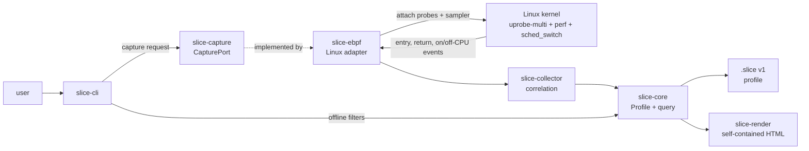

# Slice

<p align="center">
  
</p>

Slice is a Linux x86-64 percentile profiler for one focused question:

> What does the call stack look like during the slowest executions of one C++ function?

## What does this do?

Slice is built from a Rust userspace, a small C eBPF transport, and Linux perf, uprobe, and scheduler hooks.

It resolves ELF symbols, correlates invocation IDs, and renders a self-contained HTML report for offline percentile analysis.

The viewer lets you compare the complete population with a latency tail, then switch between wall time, on-CPU time, and off-CPU time without capturing again.

**You can view a live demo at** https://dorianturner.github.io/assets/slice/bimodal.html

<p align="center">
  
  
</p>

### Architecture



## Quickstart: Ubuntu / WSL 2

Slice requires 64-bit Linux with a Linux 6.6+ kernel. WSL 1 is not supported.
On WSL 2, update the kernel from an Administrator PowerShell:

```powershell
wsl --install -d Ubuntu
wsl --update
wsl --shutdown
```

Inside Ubuntu, install the native, eBPF, Rust, and test dependencies:

```bash
sudo apt update
sudo apt install -y \
  build-essential clang cmake ninja-build libbpf-dev libelf-dev zlib1g-dev \
  pkg-config curl git
```

WSL supplies its own kernel. Do not install `linux-headers-$(uname -r)`; Slice
does not need kernel headers to build.

Install Rust 1.85 or newer, then the repository task runner:

```bash
curl --proto '=https' --tlsv1.2 -sSf https://sh.rustup.rs | sh
source "$HOME/.cargo/env"
rustup default stable
rustup component add rustfmt clippy
cargo install just --locked
```

Clone the repository and run the ordinary checks. `just test-native` is the
fixture-focused path; `just check` runs the complete non-privileged gate.

```bash
git clone https://github.com/dorianturner/slice.git
cd slice
just test-native
just check
```

Generate the real bimodal capture and HTML report:

```bash
just regenerate-bimodal
```

The wrapper builds the C++ fixture and release CLI, runs `slice doctor` and
live capture with the required privilege, validates the profile, and writes:

```text
bimodal.slice
bimodal-neo-brutalist.html
```

On WSL 2, open the report in the Windows browser:

```bash
explorer.exe "$(wslpath -w "$PWD/bimodal-neo-brutalist.html")"
```

## Profile a generic function

Build the CLI and identify the exact demangled function signature in the ELF:

```bash
cargo build --release -p slice-cli
SLICE=./target/release/slice

"$SLICE" symbols /path/to/service --match request
```

Copy the complete signature from `slice symbols`, then launch the service
through Slice. The launch form attaches before the process creates worker
threads:

```bash
sudo "$SLICE" profile \
  --module /path/to/service \
  --function 'Namespace::Service::handle_request(unsigned long)' \
  --output service.slice \
  /path/to/service -- \
  --workers 4
```

To profile an already-running process, use its PID instead:

```bash
sudo "$SLICE" profile \
  --pid "$PID" \
  --module /path/to/service \
  --function 'Namespace::Service::handle_request(unsigned long)' \
  --output service.slice
```

Validate and inspect the captured profile offline:

```bash
"$SLICE" validate service.slice --require-complete --require-samples
"$SLICE" discover service.slice --metric off-cpu
"$SLICE" view service.slice \
  --output service.html \
  --percentile 95:100 \
  --metric wall
```

Use `--metric cpu` or `--metric off-cpu` to change the sampled flame graph,
and `--percentile 0:100` to view the complete valid invocation population.

## Common command cheatsheet

| Task | Command |
| --- | --- |
| Run all ordinary checks | `just check` |
| Build and test native fixtures | `just test-native` |
| Generate the live bimodal demo | `just regenerate-bimodal` |
| Check capture prerequisites | `sudo ./target/release/slice doctor` |
| Find exact ELF functions | `slice symbols <binary> --match <text>` |
| Capture a launched process | `sudo slice profile --module <elf> --function '<signature>' <program> -- <args>` |
| Capture a running PID | `sudo slice profile --pid <pid> --module <elf> --function '<signature>'` |
| Validate a profile | `slice validate <profile> --require-complete --require-samples` |
| Discover sampled functions | `slice discover <profile> --metric off-cpu` |
| Render an HTML report | `slice view <profile> --output report.html --percentile 95:100 --metric wall` |

## Technologies

| Technology | Role in Slice |
| --- | --- |
| Rust / Cargo | CLI, profile model, correlation, querying, serialization, and rendering |
| C / eBPF / libbpf | Bounded kernel-side event capture and stack IDs |
| Linux uprobes and uprobe-multi | Exact function entry and return instrumentation across process threads |
| Linux perf events | Periodic on-CPU user-stack sampling |
| `sched_switch` tracepoint | Off-CPU interval and blocked-stack attribution |
| ELF / DWARF symbols | Exact demangled function selection and user-frame resolution |
| C++ / CMake / Ninja | Native workloads used for live profiling and verification |
| Serde / JSON / zstd | Versioned, compressed `.slice` profile files |
| HTML / SVG / JavaScript | Self-contained offline timeline, histogram, and flame graph viewer |
