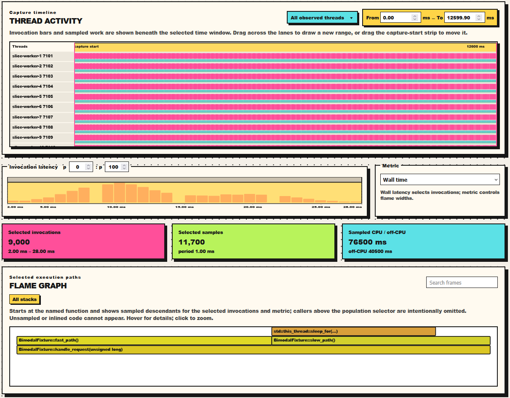
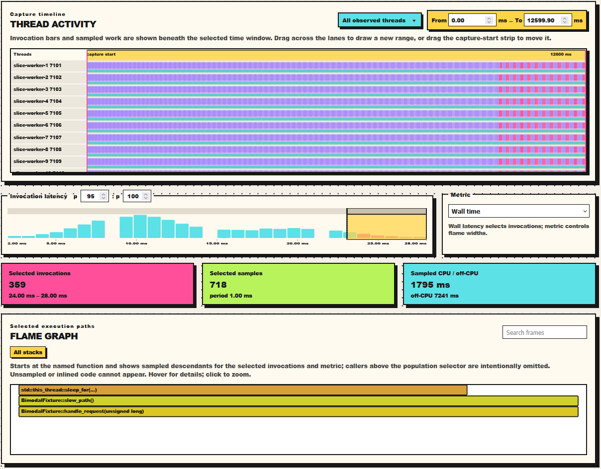

# Slice

<p align="center">
  
</p>

Slice is a Linux x86-64 percentile profiler for one focused question:

> What does the call stack look like during the slowest executions of one C++ function?

## Engineering workflow

The repository is designed for agent-first, gated development. Start with
[`AGENTS.md`](AGENTS.md), [`ARCHITECTURE.md`](ARCHITECTURE.md), and the
[engineering knowledge map](docs/index.md). Run `just check` for the ordinary
repository gates; privileged live capture is separate and documented in
[docs/testing.md](docs/testing.md). Nix remains available as an optional
reproducible development environment.

This POC attaches to one exact demangled ELF function, records its invocations
and sampled user stacks, and renders percentile-conditioned results as a
self-contained HTML flame graph.

The walkthrough below uses the `bimodal_service` fixture. It has a deterministic
70/30 latency split with normal-shaped jitter around two distinct modes:

- 70% of calls peak at 10 ms and are distributed from 2 ms to 18 ms;
- 30% of calls peak at 20 ms and are distributed from 12 ms to 28 ms, split
  between scheduler wait and 5 ms of CPU work, with visible overlap around
  15 ms.

The fixture uses 9,000 synthetic invocations across ten worker threads, with
reproducible histogram weights that are highest at each center and taper toward
the edges. That makes the generated report a useful demo without requiring a
privileged live capture.

## Demo fixture matrix

The repository includes deterministic workloads for the main user journeys:

| Scenario | Demonstrates |
| --- | --- |
| `tail` | p99 population filtering exposes a path hidden by aggregate time |
| `bimodal` | overlapping latency modes, ten worker timelines, and metric switching |
| `off-cpu` | scheduler wait attribution and an off-CPU flame graph |

Generate and inspect any offline scenario without kernel privileges:

```bash
slice fixture-profile --scenario off-cpu --output off-cpu.slice
slice validate off-cpu.slice --require-complete --require-samples
slice discover off-cpu.slice
slice view off-cpu.slice --metric off-cpu --output off-cpu.html
```

The native `nested_population` workload is a negative test for the collector:
it deliberately creates nested selected invocations so the capture records a
quality warning instead of presenting misleading percentile data. See
[`fixtures/README.md`](fixtures/README.md) for build commands and exact symbol
selectors.

## Architecture at a glance

The most important design decision is the boundary between the kernel and
userspace: eBPF performs only small, bounded capture operations, while
userspace owns symbolization, correlation, percentile selection, storage, and
visualization.

```mermaid
flowchart LR
    User["slice CLI"] --> Symbols["ELF symbol discovery<br/>demangle + exact match"]
    User --> ProfileCmd["profile command"]
    User --> ViewCmd["view / discover"]

    ProfileCmd --> Supervisor["Optional target supervisor<br/>launch, stop, resume, Ctrl-C"]
    ProfileCmd --> Capture["slice-ebpf<br/>userspace capture"]
    Supervisor --> Capture

    Capture --> Loader["Load BPF skeleton<br/>configure target TGID/function"]
    Loader --> Kernel

    subgraph Kernel["Linux kernel eBPF"]
        Entry["uprobe: function entry"]
        Return["uretprobe: function return"]
        Sample["perf_event: periodic user stack"]
        Sched["sched_switch: off-CPU intervals"]
        Active["active_by_tid"]
        Stacks["stack_traces map"]
        OffCPU["offcpu_by_tid"]
        Ring["ring buffer events"]

        Entry --> Active
        Return --> Active
        Sample --> Active
        Sample --> Stacks
        Sched --> Active
        Sched --> OffCPU
        Entry --> Ring
        Return --> Ring
        Sample --> Ring
        Sched --> Ring
    end

    Ring --> Decode["Userspace event decoding"]
    Stacks --> Resolve["ELF + /proc mapping resolver<br/>addresses → symbolized frames"]
    Decode --> Correlator["slice-collector<br/>invocation correlator"]
    Resolve --> Correlator

    Correlator --> Profile["slice-core::Profile<br/>invocations, stacks, samples,<br/>threads, metadata, quality"]
    Profile --> Store["Versioned .slice file<br/>JSON + zstd, atomic write"]

    Store --> ViewCmd
    ViewCmd --> Query["slice-core query engine<br/>thread/time/metric/percentile filters"]
    Profile --> Query
    Query --> Result["Flame tree + latency statistics"]
    Result --> Render["slice-render"]
    Render --> HTML["Self-contained interactive HTML"]
```



### Runtime flow

1. `slice profile` resolves an exact demangled C++ function to an ELF address.
2. The CLI attaches to an existing PID or launches a child, stops it before
   the first interesting call, installs instrumentation, and resumes it.
3. Kernel instrumentation emits function-entry, function-return, stack-sample,
   and scheduler-wait events through a BPF ring buffer.
4. Userspace retrieves stack IDs, resolves addresses against ELF and
   `/proc/<pid>/maps`, and converts events into collector events.
5. The collector correlates events into valid invocations and deduplicated
   stacks, while recording dropped or inconsistent data in quality counters.
6. `slice-core::Profile` becomes the stable boundary between capture, storage,
   analysis, tests, and rendering.
7. `slice view` filters valid invocations by thread, time, metric, and latency
   percentile, then builds a weighted flame tree for the selected executions.
8. `slice-render` embeds the result into one offline HTML file.

### The central profile model

`slice-core::Profile` contains the semantic capture contract:

```text
Profile
├── metadata
├── functions
├── threads
├── invocations
├── deduplicated stacks
├── weighted samples
└── capture quality counters
```

Each sample points to an invocation and a deduplicated stack. Samples also
carry an execution state (`on_cpu` or `off_cpu`) and a duration weight. This
lets the query engine distinguish wall time, CPU time, and scheduler wait
without recollecting the workload.

The profile is serialized as versioned JSON compressed with zstd and prefixed
with a file magic. Capture writes it atomically, so a failed or interrupted
write does not replace a previously valid output file.

### Why this architecture works well

- **Small kernel surface:** BPF does not symbolize, sort, calculate
  percentiles, or render HTML. The kernel path stays bounded and auditable.
- **Stable boundaries:** `slice-core` has no eBPF, filesystem, or HTML
  dependencies. Capture and rendering can evolve independently around the
  profile format.
- **Explicit correctness:** Nested calls, unmatched returns, dropped events,
  dropped stacks, and unfinished invocations become visible quality metrics
  instead of silently contaminating percentile results.
- **Efficient events:** The kernel sends compact IDs and weights through the
  ring buffer; full stack resolution happens in userspace.
- **Testability:** The collector consumes abstract events, and `slice-core`
  provides deterministic synthetic profiles for tests and demos without a live
  kernel capture.
- **Reproducible analysis:** Percentile selection and metric filtering happen
  offline from the captured profile, so the same `.slice` file can be queried
  repeatedly.

### Current trade-offs

- Linux x86-64 and C++ are currently supported.
- The selected function must execute entirely on one thread; cross-thread and
  asynchronous handoffs are not modeled.
- Nested invocations of the selected function are invalidated rather than
  modeled as a full invocation tree.
- Sampling is statistical, so extremely short work can be underrepresented.
- Long captures accumulate events and stacks in userspace memory.
- Ring-buffer and stack-capture loss is possible, but the profile exposes
  counters so consumers can judge capture quality.

### Interview-ready summary

> Slice is a percentile-conditioned profiler built as a Rust workspace with a
> small C eBPF kernel component. The CLI resolves an exact demangled ELF
> function and attaches entry/return uprobes, a perf-event stack sampler, and a
> scheduler tracepoint. The BPF side tracks active invocations by thread and
> emits compact events through a ring buffer. Userspace resolves stack IDs to
> symbols and feeds normalized events into a correlator, which produces a
> versioned `Profile` containing invocations, deduplicated stacks, weighted
> samples, and capture-quality counters. The query engine selects valid
> invocations by duration percentile and metric—wall time, CPU time, or off-CPU
> time—and builds a flame tree. Finally, the renderer embeds everything into a
> self-contained HTML report. The key architectural choice is keeping the
> kernel path minimal and making `Profile` the stable boundary between
> capture, analysis, storage, and visualization.

## Technologies and how Slice uses them

### Rust and Cargo workspaces

Rust provides the userspace implementation, type-safe profile model, CLI, BPF
loader, collector, and renderer. Cargo organizes the repository into focused
crates:

| Crate | Responsibility |
| --- | --- |
| `slice-core` | Profile format, data model, percentile query engine, synthetic profiles |
| `slice-collector` | Correlates raw capture events into invocations and samples |
| `slice-ebpf` | Loads BPF, attaches probes, reads ring-buffer events, resolves stacks |
| `slice-render` | Generates the interactive self-contained HTML viewer |
| `slice-cli` | User-facing commands and capture/view orchestration |

The workspace definition is in [`Cargo.toml`](Cargo.toml).

### eBPF

eBPF lets a program run inside the Linux kernel in response to carefully
defined events. The program is verified before loading and communicates with
userspace through maps and event buffers.

Slice uses a deliberately small C eBPF program in
[`crates/slice-ebpf/bpf/slice.bpf.c`](crates/slice-ebpf/bpf/slice.bpf.c). It
tracks only the selected function and emits compact records. Symbolization,
allocation-heavy reconstruction, and percentile math remain in Rust.

### Uprobes and uretprobes

An **uprobe** is a dynamic instrumentation hook placed at a userspace
instruction, usually a function entry in an ELF binary. A **uretprobe** runs
when that function returns.

Slice attaches an uprobe and uretprobe to the exact ELF offset of the selected
C++ function. The entry hook creates an active invocation keyed by TID; the
return hook closes it and supplies the duration boundary. This gives Slice a
complete population of function executions, rather than only a sample of
executions.

The attachment is performed in
[`capture_pid`](crates/slice-ebpf/src/lib.rs), while the kernel handlers are
`slice_entry` and `slice_return` in the BPF source.

### Perf events

Linux perf events provide periodic sampling driven by hardware or software
performance counters. Slice opens a timer-like perf event on each available
CPU and attaches the `slice_sample` BPF program to it.

When a target thread has an active selected invocation, the sampler captures a
user stack and associates a sampling-period weight with that invocation. This
approximates on-CPU time and supplies the stack population used by the flame
graph.

### Scheduler tracepoints and off-CPU time

`sched_switch` is a Linux tracepoint emitted when the scheduler switches tasks.
Slice watches it to detect when an active invocation is descheduled and when
it resumes. The interval between those events becomes an off-CPU sample.

This is why the viewer can compare:

- **Wall:** all samples,
- **CPU:** on-CPU samples only,
- **Off-CPU:** scheduler-wait samples only.

### BPF maps and ring buffers

Slice uses several BPF maps:

- `active_by_tid`: current selected invocation for each thread;
- `offcpu_by_tid`: timestamp at which an active thread was descheduled;
- `stack_traces`: deduplicated kernel-side storage for user stack addresses;
- `config`: target TGID, function ID, and sampling period;
- counters for dropped events and samples.

The ring buffer carries fixed-width event records. The event contains IDs,
timestamps, TID, CPU, stack ID, and weight rather than a full raw stack. Rust
looks up the stack separately and resolves it outside the kernel.

### ELF parsing and C++ demangling

The CLI uses ELF symbol information to list candidate functions and requires an
exact demangled signature for capture. This avoids ambiguous attachment to
overloaded or duplicated symbols. The capture resolver also uses ELF segments
and `/proc/<pid>/maps` to translate sampled instruction addresses into readable
frames.

### Serde, zstd, and the `.slice` format

`serde` and `serde_json` provide the portable in-memory representation. zstd
compresses the serialized JSON for smaller profile files. A version number and
file magic allow the loader to reject incompatible or corrupt input early.

### HTML, SVG, and JavaScript

`slice-render` produces a single HTML document containing the data and viewer
logic. The viewer renders the timeline, latency histogram, and flame graph in
the browser using SVG and JavaScript. It has no server dependency, which makes
profiles easy to archive or share as artifacts.

The offline viewer uses a neo-brutalist paper-and-ink presentation. On the
timeline, drag from one point to another to create a new time window; the
outlined window can then be refined with its handles or the numeric time
fields. Wall time is the default metric. The thread selector is a multi-select
drop-down, and dragging the timeline capture-start strip moves the existing
window instead of redrawing it.

The histogram shows the selected invocation population and its latency
percentile window. Drag across the histogram body to draw a latency range, drag
the upper rail to move the existing range, and use the percentile fields for
exact values. The Bucket control in the histogram header switches between
automatic binning and fixed widths from 0.25 ms through 5 ms. The generated
report is self-contained and can be opened directly from the filesystem.

The flame graph is built from sampled user stacks for the selected invocations
and metric. It starts at the named population function and includes recorded
descendants; it cannot show code that was never sampled or was inlined by the
compiler. Use --percentile 0:100 when the report should include the complete
invocation population rather than only a tail.

### CMake, Ninja, optional Nix, and Linux kernel facilities

- **CMake/Ninja:** build the native C++ fixtures used for live profiling.
- **Nix flakes:** pin compiler, Rust, CMake, Ninja, and BPF build tooling.
- **BTF:** kernel type information used by modern eBPF tooling and required by
  the supported setup.
- **tracefs:** exposes the `sched_switch` tracepoint and its permissions.
- **Linux capabilities:** live capture commonly needs root or capabilities
  such as `CAP_BPF`, `CAP_PERFMON`, and, for unrelated PIDs, `CAP_SYS_PTRACE`.

`slice doctor` checks the host-side prerequisites before a capture.

## Current limitations

- **Language support:** C++ only.
- **Execution model:** The selected function must execute entirely on one thread. Cross-thread or asynchronous handoffs are not currently supported.

## Example output

The self-contained viewer shows the complete invocation population, timeline,
latency histogram, and selected execution paths:



Selecting the slow tail narrows the histogram, timeline, and flame graph to the
chosen percentile window:



## Ubuntu / generic Linux setup

Slice currently targets 64-bit Linux. The commands below are written for
Ubuntu 22.04 or 24.04 and should be straightforward to adapt to other
distributions.

Install the native, BPF, and Rust build dependencies:

```bash
sudo apt update
sudo apt install -y \
  build-essential clang llvm libclang-dev libbpf-dev libelf-dev zlib1g-dev \
  pkg-config cmake ninja-build linux-headers-$(uname -r) curl git
```

Install Rust 1.85 or newer with `rustup` if it is not already available:

```bash
curl --proto '=https' --tlsv1.2 -sSf https://sh.rustup.rs | sh
source "$HOME/.cargo/env"
rustup default stable
```

From the repository root, run the tests and build the native fixture:

```bash
cargo test --workspace
cmake -S fixtures -B build/fixtures -G Ninja
cmake --build build/fixtures
```

Build the CLI in release mode:

```bash
cargo build --release
```

Before a live capture, check that the running kernel exposes BTF and the
required scheduler tracepoint. Capture generally needs root privileges because
it uses eBPF and perf events:

```bash
sudo ./target/release/slice doctor
```

If `slice doctor` reports missing BTF or tracefs permissions, use a distro
kernel with BTF enabled and make sure `/sys/kernel/btf/vmlinux` and tracefs
are mounted. The exact kernel configuration is distribution-specific.

## NixOS setup

This repository has two different Nix environments. Use them in separate
shells:

- `nix develop` provides the pinned compiler, CMake, Ninja, Rust, and BPF
  build tools. It does not provide the packaged `slice` executable.
- `nix shell .#default --command slice ...` provides the packaged `slice`
  executable. For live eBPF capture on NixOS, run that command with `sudo`.

Do not rely on bare `sudo nix shell .#default` to create the interactive shell
on NixOS. On some configurations the root shell startup files replace the
`PATH` that Nix prepared, leaving `slice` unavailable. Use the explicit
`--command` form below. Also do not run `nix develop` inside it: that is a
different environment and does not contain the packaged CLI.

From the repository root, build the native fixture as your normal user:

```bash
nix develop
cmake -S fixtures -B build/fixtures -G Ninja
cmake --build build/fixtures
```

You should now have:

```text
build/fixtures/bimodal_service
```

Leave the development shell before starting the privileged runtime shell:

```bash
exit
```

The dirty-tree warning printed by Nix is informational; it does not prevent
the local flake from being used.

## Profile the bimodal fixture

Choose the CLI path for the rest of the walkthrough:

```bash
# Ubuntu / generic Linux source build
SLICE=./target/release/slice

# NixOS packaged build (run this inside the prepared NixOS shell)
SLICE=slice
```

On Ubuntu, the first prerequisite check is:

```bash
sudo "$SLICE" doctor
```

On NixOS: 

```bash
sudo nix shell .#default --command bash --noprofile --norc -i
```

Then run the commands below using `$SLICE ...`.

### 1. Check capture prerequisites

```bash
sudo "$SLICE" doctor
```

Root is normally enough for this POC on a standard Ubuntu or NixOS kernel. The output
should report available kernel BTF and a permitted `sched_switch` tracepoint.
If it still reports a permission or kernel problem, the issue is with the
host's eBPF/tracefs configuration, not with the Nix shell.

### 2. Find the exact function signature

```bash
"$SLICE" symbols build/fixtures/bimodal_service --match handle_request
```

Copy the complete demangled signature from the output. For this fixture it is:

```text
BimodalFixture::handle_request(unsigned long)
```

### 3. Capture the live workload

Run Slice as the supervisor so it launches the fixture, attaches before the
first request, and captures until you stop it:

```bash
sudo "$SLICE" profile \
  --function 'BimodalFixture::handle_request(unsigned long)' \
  --output bimodal.slice \
  build/fixtures/bimodal_service -- --workers 10
```

The fixture runs continuously. Let it run for roughly 10 seconds, then press
Ctrl-C in the profiling shell. Slice stops the child, drains pending events,
and writes `bimodal.slice`.

A successful run ends with a line similar to:

```text
captured BimodalFixture::handle_request(unsigned long) at PID ... -> bimodal.slice
```

If capture fails before that line, no usable profile was written. Fix the
reported `slice doctor` or kernel error before trying to view the file.

### 4. Render the complete capture

Render the capture through the packaged CLI:

```bash
"$SLICE" view bimodal.slice --output bimodal.html --percentile 0:100
```

Open the generated file in a browser:

```bash
firefox bimodal.html
```


## Useful commands

```text
slice symbols <binary> [--module <elf>] [--match <substring>]
slice profile --function '<full signature>' PROGRAM [-- ARGS...]
slice profile --pid <PID> --module <elf> --function '<full signature>'
slice view capture.slice --output profile.html [--percentile 95:100]
slice discover capture.slice
slice doctor
```
